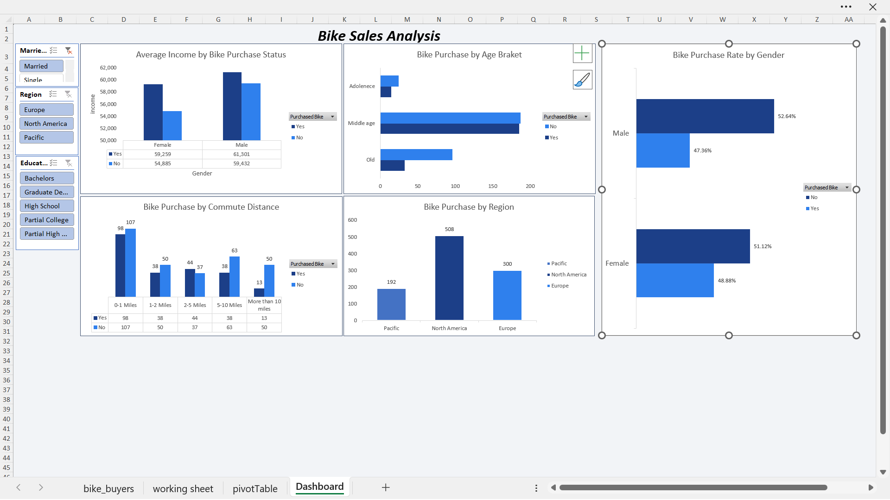

# Bike Sales Analysis

Exploring what drives customers to purchase a bike, using demographic and lifestyle data (income, age, commute distance, occupation, marital status, and more).

## Goal
Identify which customer characteristics are associated with a higher likelihood of purchasing a bike useful for shaping targeted marketing or understanding the customer base.

## Tools
Excel (PivotTables, PivotCharts, Slicers)

## Dataset
`Bike_sales_Analysis.xlsx` — 1,026 customer records with the following fields:
`ID, Marital Status, Gender, Income, Children, Education, Occupation, Home Owner, Cars, Commute Distance, Region, Age, Purchased Bike`

The workbook contains:
- **bike_buyers** — raw source data
- **working sheet** — cleaned/relabeled data with an added Age Bracket column
- **pivotTable** — summary tables (average income by gender/purchase outcome, etc.)
- **Dashboard** — interactive dashboard with slicers for gender, region, and commute distance

## Key observations
- Customers who purchased a bike had a **higher average income** than those who didn't, across both genders (e.g. Male buyers: ~$60,100 vs ~$56,200 non-buyers).
- Commute distance shows a **noticeable split at longer distances**  worth digging into further to see if it's a genuine trend or a data quirk.
- Purchase rate breakdowns by gender and occupation are available in the dashboard's interactive slicers.

## Preview

## How to use
1. Download `Bike_sales_Analysis.xlsx`
2. Open in Excel (slicers require Excel 2010+)
3. Explore the `Dashboard` sheet, or dig into `pivotTable` / `working sheet` for the underlying calculations
